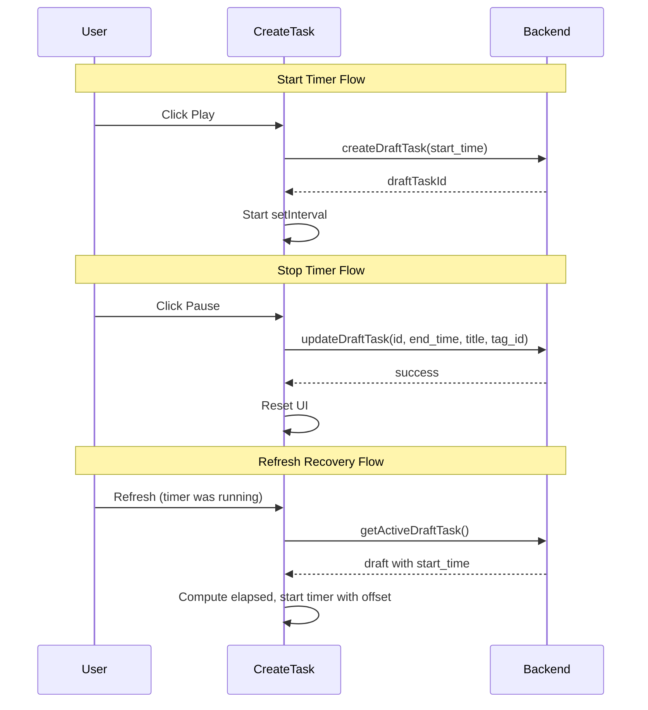

# Draft Task Timer Feature

## Overview

Implement a draft task workflow where the timer creates a backend record immediately on start (with only `start_time`), and completes it on pause with `title`/`tag`/`end_time`. On page refresh, the app fetches any active draft and resumes the timer from the elapsed difference.

---

## Problem Statement

The current timer relies entirely on client-side state (`setInterval`). Accidental refresh, browser idle, or tab switching can reset the timer and lose tracking. The solution is to anchor the start time on the backend immediately.

---

## Architecture Overview



---

## Key Files to Modify

| File | Changes |
|------|---------|
| `src/service/task.js` | Add new query and mutations |
| `src/components/Task/CreateTask.js` | Core timer logic changes |
| `src/utils/task.js` | Handle draft tasks in grouping (exclude from list) |
| `src/components/TaskList/TaskShow.js` | Filter out draft tasks from display |

---

## 1. Backend API (GraphQL)

### New Query: `GetActiveDraftTask`

Fetch the user's single active draft (`end_time` is null). At most one per user.

```graphql
query GetActiveDraftTask($author_id: Int!) {
  time_tracker_tasks(
    where: { author_id: { _eq: $author_id }, end_time: { _is_null: true } }
    limit: 1
    order_by: { start_time: desc }
  ) {
    id
    start_time
    title
    tag_id
  }
}
```

### New Mutation: `updateDraftTask`

Complete a draft by setting `end_time`, `title`, and `tag_id`.

```graphql
mutation updateDraftTask($id: Int!, $end_time: timestamptz!, $title: String!, $tag_id: Int) {
  update_time_tracker_tasks_by_pk(
    pk_columns: { id: $id }
    _set: { end_time: $end_time, title: $title, tag_id: $tag_id }
  ) {
    id
    end_time
    title
    tag_id
  }
}
```

### Create Draft

Reuse existing `createOneTask` with:

- `title`: placeholder `"Draft"` (backend requires String!)
- `start_time`: current UTC timestamp
- `end_time`: null (omit or pass null)
- `tag_id`: null
- `author_id`: user id

---

## 2. CreateTask Component Changes

### State Additions

- `draftTaskId` — ID of the draft task when timer is running (or resumed)
- `draftStartTime` — Backend `start_time` (used to compute elapsed on resume)

### Flow: Start Timer

**First start (no draft):**

1. Call `createOneTask` with placeholder title, `start_time`, `end_time: null`, `tag_id: null`
2. Store returned `id` in `draftTaskId`, `start_time` in `draftStartTime`
3. Start setInterval as today

**Resume (after refresh, draft exists):**

1. On mount: run `GetActiveDraftTask`
2. If draft exists: set `draftTaskId`, `draftStartTime` from response
3. Compute elapsed: `moment().diff(moment(draftStartTime))` in seconds
4. Set timer display to elapsed (e.g. 01:23:45)
5. Start setInterval from that offset (sec = elapsed % 60, min = floor(elapsed/60) % 60, hr = floor(elapsed/3600))
6. Set `isTimerRunning: true`

### Flow: Stop Timer

1. Call `updateDraftTask` with `id: draftTaskId`, `end_time: getCurrentTime()`, `title`, `tag_id`
2. Clear draft state, reset timer UI, trigger refetch

### Validation on Stop

- Require `title` and `tagId` before allowing stop (same as current validation)
- If user tries to stop without title/tag, show existing error toast

### Edge Cases

- **Discard draft:** If user wants to abandon a resumed draft without completing, add optional "Discard" action that deletes the draft (reuse `deleteOneTask`)
- **Multiple tabs:** If user opens another tab and starts a new timer, both could create drafts. Consider: only one draft per user; second start could either fail or replace (delete old draft, create new). Simplest: allow one draft; second tab's start would see existing draft and resume it.

---

## 3. Task List and Utils

### Exclude Drafts from Task List

- **GetTasks:** Add filter `end_time: { _is_null: false }` so completed tasks only
- **tasksByTime:** Already uses `getDurationTime(start_time, end_time)`; draft tasks with null `end_time` would break. Filtering at query level avoids this.

### Update GetTasks Query

```graphql
# Add to where clause:
where: {
  author_id: { _eq: $author_id }
  end_time: { _is_null: false }  # Exclude draft tasks
}
```

---

## 4. Implementation Order

1. Add `GetActiveDraftTask` and `updateDraftTask` to `src/service/task.js`
2. Update `GetTasks` where clause to exclude drafts
3. Refactor `src/components/Task/CreateTask.js`:
   - Add `useEffect` for mount: fetch active draft, resume if found
   - Change `startTimer`: create draft via API first, then start interval
   - Change `stopTimer`: call `updateDraftTask` instead of `createOneTask`
4. Add optional "Discard draft" button when timer is resumed from draft (so user can abandon without completing)

---

## 5. Backend Schema Assumptions

- `time_tracker_tasks.end_time` is nullable (already implied by createOneTask)
- `update_time_tracker_tasks_by_pk` supports partial `_set` for `end_time`, `title`, `tag_id`
- If `title` cannot be null in DB, use placeholder `"Draft"` when creating

---

## 6. Optional: Discard Draft

When timer is running from a resumed draft, show a small "Discard" link that:

- Calls `deleteOneTask` with draft id
- Resets timer state
- Prevents accidental loss with a confirm dialog
